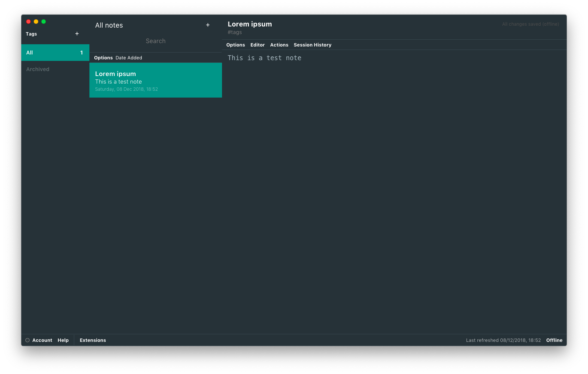

# Material Theme for StandardNotes
Material Theme for StandardNotes Dekstop or Web.

## Installation
1. Open StandardNotes
2. In the bottom left corner, click "Extensions", then "Import Extension"
3. Enter "https://raw.githubusercontent.com/vantezzen/sn-theme-material/master/extension.json" as the extension link
4. Click enter and confirm the installation
5. Activate the extension

## Based on
This theme is based on:
- [StandardNotes Solarized Dark Theme](https://github.com/sn-extensions/solarized-dark-theme) as a template for the CSS
- [Atom Material UI Theme](https://github.com/atom-material/atom-material-ui) for the colors